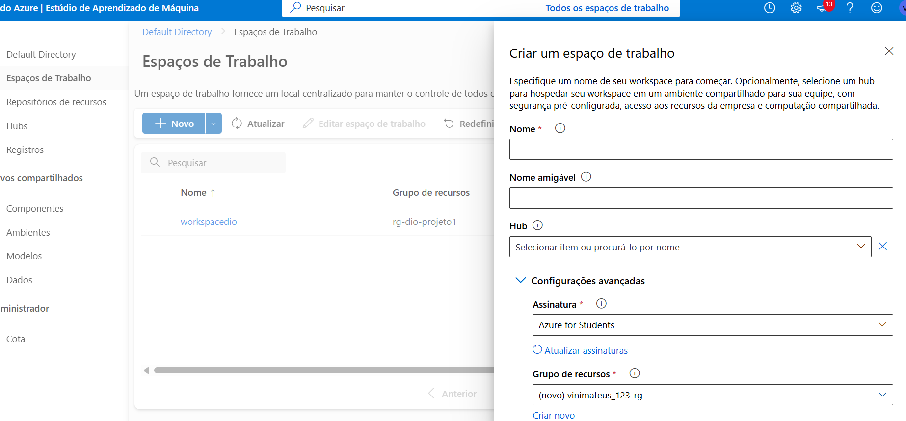
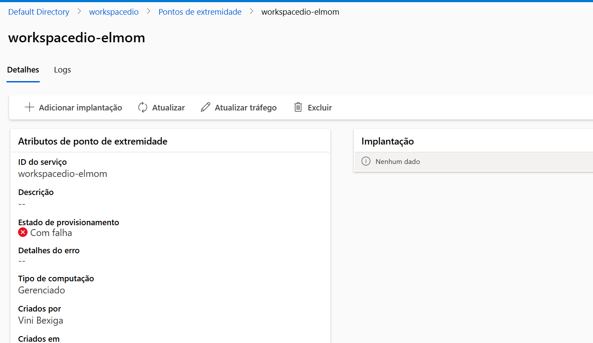
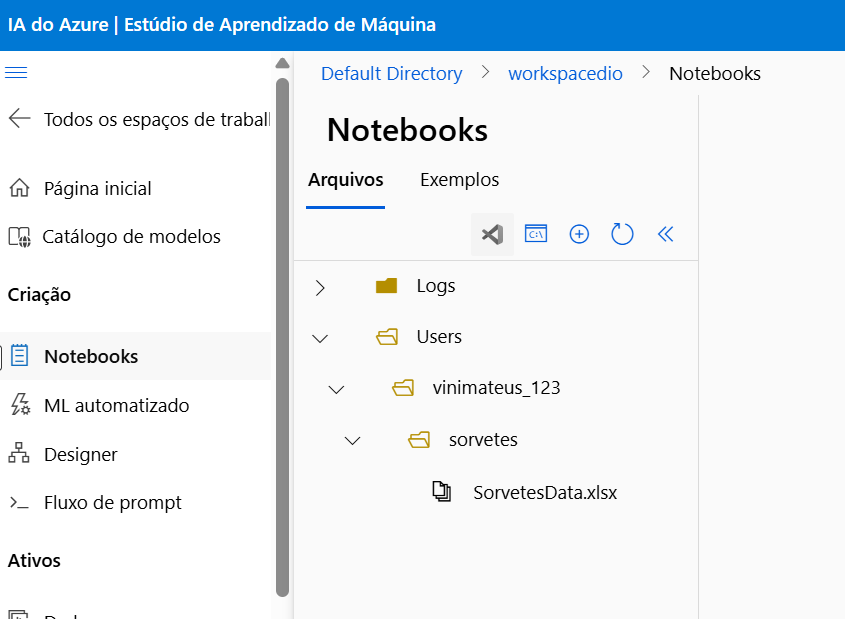
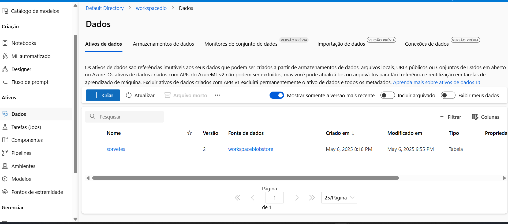
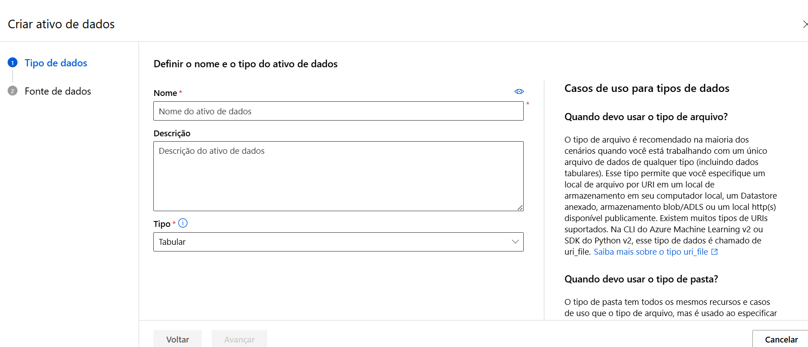
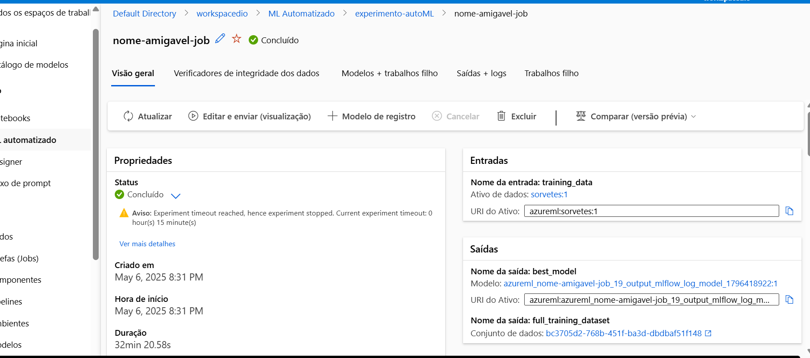
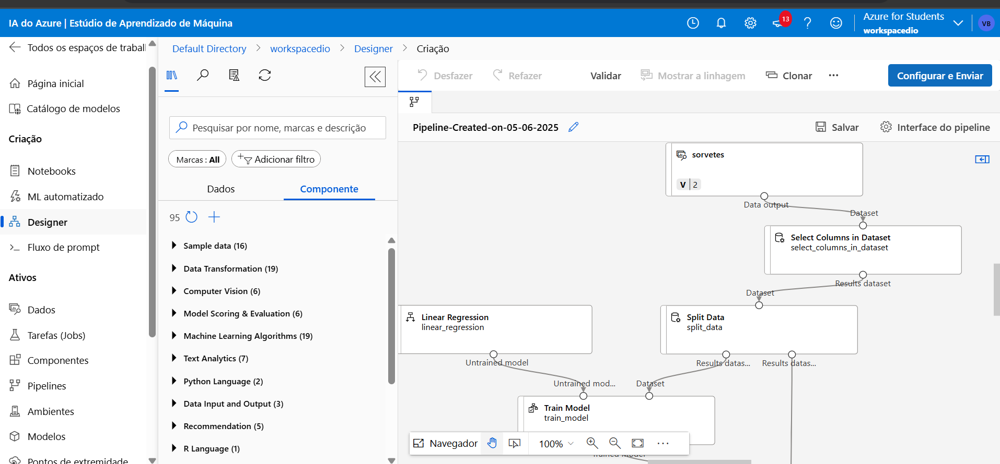

# PrimeirodeML
## Criando um ambiente do azure machine learning com o objetivo de prever futuras vendas de sorvete, baseadas em venda de acordo com a temperatura do dia.
### Primeiro, criei um grupo de recursos para colocar o workspace a ser criado para treinamento.
 

Eu criei e inseri a pasta na aba "Notebooks" com o nome "sorvetes" e um arquivo "SorvetesDaTa.xlsx" contendo dados coletados do Microsoft Copilot.

Após isso eu fui criar um ativo de dados para a automação. Criei um arquivo local com o nome "Sorvetes", coloquei um arquivo .csv para reduzir o tamanho e ver se era compatível com a base da criação do ativo de dados, pois o .xlsx não havia funcionado.
 

Logo depois, criei um MLAutomatizado seguindo as orientações, com um destino ao "cpu-cluster-vini" com um tempo limite de 15 minutos. Apenas com os algoritmos PCA, XGBoostRegressor para maior foco e mais rapidez.

Por fim, criei um pipeline seguindo as orientações, mas tive que criar outro por conta de um erro na igualdade dos nomes das colunas. 

As duas tarefas foram executadas e concluídas com êxito. 
Minha dificuldade foi implatar os modelos no final, não tentei me afundar nisso pois fiquei um pouco perdido.
